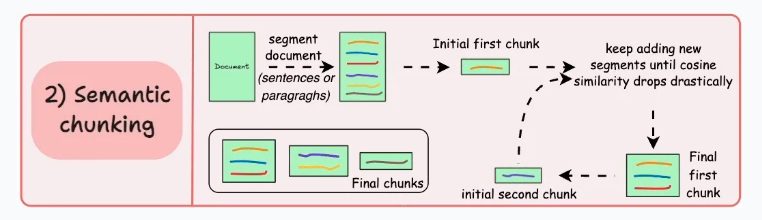

### **📝 Simple Semantic Chunking**

---

### **🔹 How This Works:**
1. **Uses spaCy** to split text into sentences.
2. **Groups sentences into chunks** of `max_sentences` (default 3).
3. **Preserves meaning** better than fixed-size chunking.

---

### **📝 Example Output:**
```
Chunk 1: Semantic chunking groups sentences based on meaning rather than fixed sizes. 
For example, two sentences discussing the same idea should be in the same chunk.

Chunk 2: If the topic shifts, a new chunk is created. This ensures that chunks remain meaningful and contextually intact.

Chunk 3: Traditional chunking methods, like fixed-size chunking, often break important information. 
With semantic chunking, text retrieval and understanding improve significantly.
```
