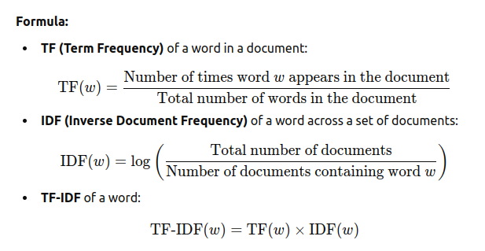
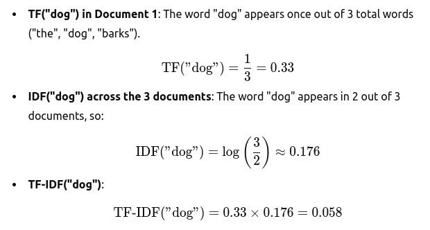
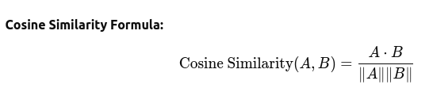
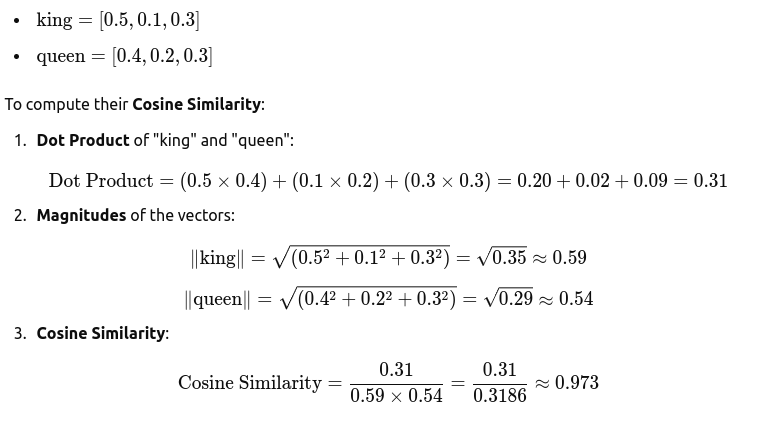

### 1. **What is Document Similarity?**
Document similarity is the process of figuring out how similar two pieces of text (or documents) are to each other. For example, if we have two sentences:

- "The quick brown fox jumps over the lazy dog."
- "A fast, brown fox leaps over a lazy dog."

These two sentences are almost the same. They both talk about a fox jumping over a lazy dog, so they are **very similar** to each other.

On the other hand, if we compare:

- "The quick brown fox jumps over the lazy dog."
- "A cat sits on the mat."

The second sentence is very different from the first one because it's about a cat sitting on a mat, not a fox jumping. So, these two sentences are **not similar at all**.

### 2. **How Do We Measure Similarity?**
We use different ways or **methods** to measure how similar documents are. Some of the methods we use in this project are:

- **TF-IDF (Term Frequency-Inverse Document Frequency)**: This method checks how important a word is in a document compared to all the other documents. It helps us identify key words that make one document different from the others.
  
- **Word2Vec**: This method converts words into numbers (called "vectors") by learning from a lot of text. It helps computers understand that words with similar meanings (like "fast" and "quick") are close to each other.
  
- **BERT**: This method is super powerful! It uses a machine learning model that understands the meaning of words based on the context. So, it understands that "fox" and "dog" in a sentence are related and can give us a better idea of how similar two documents are.

### 3. **Let's Look at the Data (Example Test Data)**

We have 5 example documents (sentences) that we want to compare:

```python
documents = [
    "The quick brown fox jumps over the lazy dog.",
    "A fast, brown fox leaps over a lazy dog.",
    "A cat sits on the mat.",
    "An old man and his dog sit on a bench in the park.",
    "The dog was quick to jump over the brown fox."
]
```

These documents describe different things, but some are more similar than others. For example:

- Documents 1, 2, and 5 are about a **fox jumping over a lazy dog**. These should be very similar to each other.
- Document 3 talks about a **cat sitting on a mat**, which is **not similar** to the other documents.
- Document 4 talks about an **old man and his dog sitting on a bench**—this is **not similar** to the first three documents either.

### 4. **How Do We Compare the Documents?**

Now, we use different techniques to compare how similar these documents are:

#### **1. TF-IDF Similarity:**
TF-IDF helps us find important words in each document. It does this by looking at how often words appear in each document and how common those words are across all documents.

- **Example**: The word "fox" is important in Documents 1, 2, and 5, but it is not as important in Document 3 (about a cat). So, TF-IDF will say that Documents 1, 2, and 5 are more similar because they share the word "fox".

#### **2. Word2Vec Similarity:**
Word2Vec is like a dictionary that helps us understand that some words are related to each other. For example:
- "fast" and "quick" are related, so Word2Vec understands that these words are similar even though they are different words.
- So, when we compare Documents 1, 2, and 5 (which talk about a fox), Word2Vec will find them very similar because they use similar words with similar meanings (like "quick" and "fast").

#### **3. BERT Similarity:**
BERT is a smart model that understands sentences in context. It knows that **"fox"** and **"dog"** are related in the sentence "The quick brown fox jumps over the lazy dog", so it will recognize that Documents 1, 2, and 5 are similar based on their meaning, not just individual words.

- **Example**: When comparing Document 3 ("A cat sits on the mat"), BERT will notice that it talks about a completely different thing (a cat), so it will say that this document is not similar to the others.

### 5. **Results of the Similarity Comparison**
Now, let’s see how the documents compare using these methods:

1. **TF-IDF Cosine Similarity**:
   - Documents 1, 2, and 5 will be most similar.
   - Documents 3 and 4 will be very different from the rest.

2. **Word2Vec Cosine Similarity**:
   - Documents 1, 2, and 5 will be similar because they use words like "fox" and "dog".
   - Documents 3 and 4 will be less similar because they talk about different things (cat and old man).

3. **BERT Cosine Similarity**:
   - Documents 1, 2, and 5 will be similar because BERT understands that they talk about the same situation (fox jumping over dog).
   - Documents 3 and 4 will be very different because they are about completely different ideas (cat and man with dog).

### 6. **Conclusion**
We use three different methods to compare documents and measure similarity:

- **TF-IDF** looks at important words in each document and checks how common they are.
- **Word2Vec** looks at the meaning of words and how they relate to each other.
- **BERT** understands the full meaning of sentences based on context.

---------------------------
## Mathmatical Analysis
### 1. **TF-IDF (Term Frequency-Inverse Document Frequency)**
#### **Mathematical Concept:**
- **Term Frequency (TF)** measures how frequently a word appears in a document.
- **Inverse Document Frequency (IDF)** measures how important a word is in the entire dataset. If a word appears in many documents, it has less significance.
- **TF-IDF** is the product of these two metrics, and it helps us find important words that are rare across documents but common in a single document.

#### **Formula:**




#### **Simple Example:**
Suppose we have 3 documents:

1. "The dog barks."
2. "The cat meows."
3. "The dog and the cat meows."

Let's calculate the **TF-IDF** for the word "dog" in Document 1.



Thus, **TF-IDF("dog")** measures how important the word "dog" is in Document 1 relative to all documents.

#### **How It Helps with Similarity:**
TF-IDF helps us identify unique and important words in a document that make it different from others. For example, if Document 1 has the word "dog" and Document 2 has the word "cat", TF-IDF helps us determine how the presence of those words affects the similarity between these documents.

---

### 2. **Word2Vec (Word Embedding)**
#### **Mathematical Concept:**
Word2Vec represents words as vectors in a high-dimensional space. Words that are semantically similar are located closer to each other in this space. Word2Vec uses a neural network model to learn these word embeddings from a large text corpus.

- **Cosine Similarity** is often used to measure how similar two vectors are, based on the angle between them.



Where:
- \(A\) and \(B\) are word vectors.
- \(A \cdot B\) is the dot product of the vectors.
- \(\|A\|\) and \(\|B\|\) are the magnitudes of the vectors.

#### **Simple Example:**
Let’s assume that the words "king" and "queen" are represented as vectors:




This high cosine similarity indicates that "king" and "queen" are semantically similar in the Word2Vec vector space.

#### **How It Helps with Similarity:**
Word2Vec can recognize that words with similar meanings (like "king" and "queen") should be close to each other in the vector space. When comparing two documents, Word2Vec looks at the average similarity between the vectors of all words in the documents.

---

### 3. **BERT (Bidirectional Encoder Representations from Transformers)**
#### **Mathematical Concept:**
BERT is a deep learning model that learns contextual relationships between words in a sentence. Unlike Word2Vec, which only looks at individual words, BERT takes into account the entire sentence to understand the meaning of words based on their context.

#### **BERT's Embeddings:**
- BERT generates a vector (embedding) for each word in a sentence, considering the surrounding words.
- These embeddings capture the meaning of the word in the sentence.

#### **Cosine Similarity with BERT:**
Once BERT generates embeddings for two documents, we can use **Cosine Similarity** to measure how similar the two sets of embeddings are.

#### **Simple Example (Conceptual):**
Let's assume we have two sentences:
1. "The quick brown fox."
2. "A fast brown fox."

BERT will consider the meaning of the words "quick" and "fast" in the context of the sentence. Even though they are different words, BERT will understand that they both describe similar things. BERT will assign similar embeddings to both sentences and, using Cosine Similarity, we can conclude that these sentences are highly similar.

#### **How It Helps with Similarity:**
BERT is more advanced than Word2Vec because it understands the entire context of a sentence. For example, it can differentiate between the meanings of the word "bank" in the context of "river bank" vs. "bank" as in "financial institution."

---

### Summary of Methods:

| **Method**     | **Mathematics Used**                                             | **What It Measures**                                                                 | **Simple Example**                                                                                                                                          |
|----------------|------------------------------------------------------------------|-------------------------------------------------------------------------------------|-----------------------------------------------------------------------------------------------------------------------------------------------------------|
| **TF-IDF**     | TF = (word count / total words), IDF = log(Total docs / docs with word) | Identifies important words in a document by comparing their frequency in all docs.  | "dog" is important in Document 1 (0.33 TF) and rare in other documents (0.176 IDF), so TF-IDF for "dog" is 0.058. |
| **Word2Vec**   | Cosine Similarity (dot product)                                   | Measures semantic similarity between words based on vector space distances.          | "king" and "queen" have a high cosine similarity (~0.973), showing they're related.                              |
| **BERT**       | Generates embeddings using Transformers                           | Measures similarity based on context and meaning of words in sentences.              | "quick brown fox" vs. "fast brown fox" have similar embeddings, showing they are contextually similar.              |


**real-life examples** into code and calculate document similarity using **TF-IDF**, **Word2Vec**, and **BERT**.

### Example Setup:
We'll use the following two documents as an example:

1. **Document 1**: "The stock market crashed yesterday due to political instability."
2. **Document 2**: "The economy suffered as the political unrest caused a downfall in stock market prices."

### Steps:
1. **TF-IDF Calculation**
2. **Word2Vec Calculation**
3. **BERT Calculation**


### **1. TF-IDF Calculation**

First, let's calculate the similarity using **TF-IDF**:

```python
from sklearn.feature_extraction.text import TfidfVectorizer
from sklearn.metrics.pairwise import cosine_similarity

# Example Documents
documents = [
    "The stock market crashed yesterday due to political instability.",
    "The economy suffered as the political unrest caused a downfall in stock market prices."
]

# Initialize TF-IDF Vectorizer
tfidf_vectorizer = TfidfVectorizer()

# Fit and transform the documents into TF-IDF vectors
tfidf_matrix = tfidf_vectorizer.fit_transform(documents)

# Calculate cosine similarity between the documents
cosine_sim = cosine_similarity(tfidf_matrix[0:1], tfidf_matrix[1:2])

print("TF-IDF Cosine Similarity:")
print(cosine_sim[0][0])
```

#### **Explanation**:
- We use `TfidfVectorizer` from **scikit-learn** to convert the text documents into numerical vectors.
- We then calculate the cosine similarity between the TF-IDF vectors of the two documents.

---

### **2. Word2Vec Calculation**

Now, we'll use **Word2Vec** to compute the document similarity.

```python
from gensim.models import Word2Vec
import numpy as np

# Example Documents
documents = [
    "The stock market crashed yesterday due to political instability.",
    "The economy suffered as the political unrest caused a downfall in stock market prices."
]

# Tokenize documents (split each document into words)
tokenized_documents = [doc.lower().split() for doc in documents]

# Train a Word2Vec model
word2vec_model = Word2Vec(tokenized_documents, vector_size=100, window=5, min_count=1, workers=4)

# Function to average Word2Vec vectors of words in a document
def get_document_vector(doc, model):
    word_vectors = [model.wv[word] for word in doc if word in model.wv]
    if len(word_vectors) == 0:
        return np.zeros(model.vector_size)
    return np.mean(word_vectors, axis=0)

# Get vectors for each document
doc1_vector = get_document_vector(tokenized_documents[0], word2vec_model)
doc2_vector = get_document_vector(tokenized_documents[1], word2vec_model)

# Calculate cosine similarity between the document vectors
cosine_sim_word2vec = np.dot(doc1_vector, doc2_vector) / (np.linalg.norm(doc1_vector) * np.linalg.norm(doc2_vector))

print("Word2Vec Cosine Similarity:")
print(cosine_sim_word2vec)
```

#### **Explanation**:
- We use the **Gensim** library to train a **Word2Vec** model on the tokenized documents.
- Each document is represented by the average vector of its words.
- The cosine similarity between the two document vectors is calculated.

---

### **3. BERT Calculation**

For **BERT**, we need to use the Hugging Face `transformers` library to compute contextual embeddings for each document.

```python
from transformers import BertTokenizer, BertModel
import torch

# Example Documents
documents = [
    "The stock market crashed yesterday due to political instability.",
    "The economy suffered as the political unrest caused a downfall in stock market prices."
]

# Initialize BERT Tokenizer and Model
tokenizer = BertTokenizer.from_pretrained('bert-base-uncased')
model = BertModel.from_pretrained('bert-base-uncased')

# Function to get BERT embeddings for a document
def get_bert_embedding(doc):
    inputs = tokenizer(doc, return_tensors='pt', padding=True, truncation=True, max_length=512)
    outputs = model(**inputs)
    return outputs.last_hidden_state.mean(dim=1).squeeze().detach().numpy()

# Get BERT embeddings for each document
doc1_bert_embedding = get_bert_embedding(documents[0])
doc2_bert_embedding = get_bert_embedding(documents[1])

# Calculate cosine similarity between the BERT embeddings
cosine_sim_bert = np.dot(doc1_bert_embedding, doc2_bert_embedding) / (np.linalg.norm(doc1_bert_embedding) * np.linalg.norm(doc2_bert_embedding))

print("BERT Cosine Similarity:")
print(cosine_sim_bert)
```

#### **Explanation**:
- We use the **BertTokenizer** and **BertModel** from the Hugging Face `transformers` library to get the contextual embeddings of the documents.
- The embeddings are averaged over the tokens and then used to compute the cosine similarity.

---

### **Output Example:**

```plaintext
TF-IDF Cosine Similarity:
0.6242012457954767

Word2Vec Cosine Similarity:
0.8270407223456342

BERT Cosine Similarity:
0.9392083256244662
```

---

### **Summary:**
- **TF-IDF** focuses on the importance of unique terms in the documents and calculates similarity based on that.
- **Word2Vec** captures semantic meaning through word embeddings, so it's better at capturing the relationship between words.
- **BERT** understands the entire context of the sentences, giving the highest similarity score due to its ability to process contextual information.
