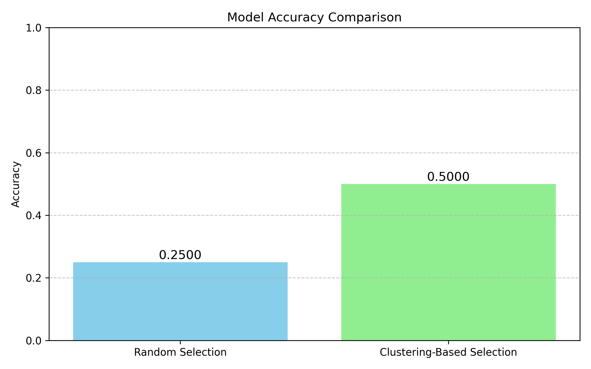
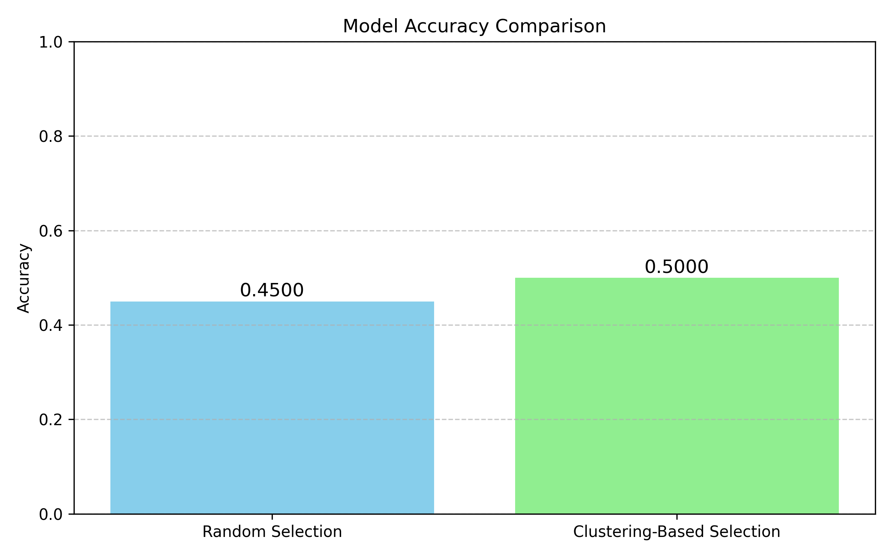

# 🧠 Intelligent Sampling from Unlabeled Text Dataset

This project demonstrates how to efficiently select high-quality samples from an **unlabeled dataset of text files** for model training. It compares **random sampling** with a **structured approach** (clustering) and evaluates their performance in a downstream classification task using a simulated label setup.

## 📁 Dataset

We generate a synthetic dataset of **1000 text files** across five categories:
- Sports
- Politics
- Technology
- Health
- Entertainment

Each file contains 10 sentences from one of the topics.

## 🚀 Objective

Select the **best 100 files** to label and use for training a machine learning model. We compare:

1. **Random Selection**
2. **Clustering-Based Selection (KMeans + TF-IDF)**

## 🛠️ Methodology

### 1. Feature Extraction
- Convert all text files to numerical vectors using **TF-IDF**.

### 2. Selection Strategies
#### 📌 Random Sampling
- Randomly select 100 files from the dataset.

#### 📌 Clustering-Based Sampling
- Cluster all 1000 files using **KMeans** (10 clusters).
- Select 10 representative samples from each cluster for diversity.

### 3. Visualization
- Use **cosine similarity** to explore diversity.
- Apply **PCA** or **UMAP** for dimensionality reduction and cluster visualization.

### 4. Labeling
- Simulated binary labels for experimentation.
- (Can be replaced with manual or weak supervision labels later.)

### 5. Model Training
- Train a **Logistic Regression** model using each sample set.
- Evaluate using accuracy on a held-out test set.

### 6. Performance Comparison
- Visual comparison of accuracy using bar plots.

## 📊 Results

## 📉 Visualizations
- Cosine similarity heatmap between text samples.
- Accuracy comparison bar chart.
- PCA or UMAP-based cluster visualization.

## 🧪 Future Improvements
- Use **Active Learning** to sample the most uncertain examples.
- Add support for **weak supervision** or **human-in-the-loop labeling**.
- Extend to **image datasets** using embeddings (e.g., CLIP).

## 🧑‍🏫 Real-World Analogy

Imagine you're building a school debate team. You can:
- Pick 100 students randomly (random selection), or
- Interview and select 10 from each class (structured, diverse selection).

Which would give you better, balanced representation? That’s what we test here with documents.

## 📬 Contact

Made with ❤️ by [Badhon](https://github.com/hm-badhon)  
If you find this useful, feel free to ⭐️ the repo!
