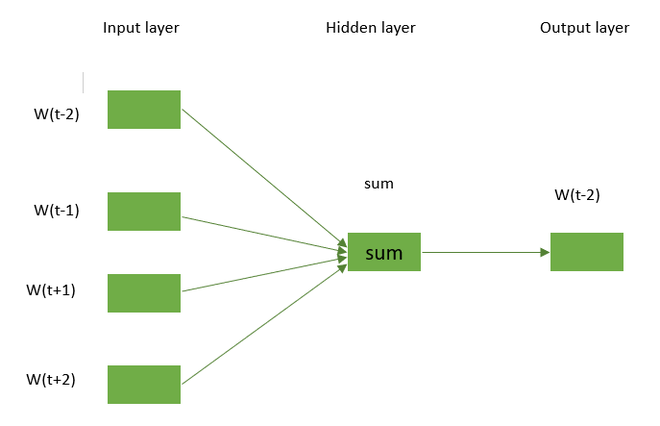

# Analysis of Neural Word Embeddings in NLP

## Table of Contents
- [Introduction](#introduction)
- [1. Neural Approach to Word Embeddings](#1-neural-approach-to-word-embeddings)
  - [1.1. Word2Vec](#11-word2vec)
  - [1.2. Continuous Bag of Words (CBOW)](#12-continuous-bag-of-words-cbow)
  - [1.3. Skip-Gram](#13-skip-gram)
- [2. Pretrained Word Embeddings](#2-pretrained-word-embeddings)
  - [2.1. GloVe](#21-glove)
  - [2.2. FastText](#22-fasttext)
  - [2.3. BERT](#23-bert)
- [3. Considerations for Deploying Word Embedding Models](#3-considerations-for-deploying-word-embedding-models)
- [4. Advantages and Disadvantages of Word Embeddings](#4-advantages-and-disadvantages-of-word-embeddings)
- [Conclusion](#conclusion)

## Introduction
This document provides an overview and analysis of various neural word embedding techniques widely used in Natural Language Processing (NLP). Word embeddings are crucial in representing words in a continuous vector space, where words with similar meanings are mapped closer together. The neural approaches to word embeddings, such as Word2Vec, along with pretrained models like GloVe, FastText, and BERT, are explored in this analysis.

## 1. Neural Approach to Word Embeddings

### 1.1. Word2Vec
Word2Vec is a neural network-based model that transforms words into continuous vector spaces. Developed by a team at Google, this model captures semantic relationships between words, making it a powerful tool in NLP tasks. Word2Vec operates using two main architectures: Continuous Bag of Words (CBOW) and Skip-Gram.

### 1.2. Continuous Bag of Words (CBOW)
The Continuous Bag of Words (CBOW) is a natural language processing technique used to create word embeddings, which represent the semantic and syntactic relationships between words. It is a neural network-based algorithm that predicts a target word based on its surrounding context words. CBOW is unsupervised, meaning it learns from unlabeled data, and is often used to pre-train word embeddings for NLP tasks like sentiment analysis, text classification, and machine translation.

**Key Points:**
- CBOW predicts the target word using context words.
- It uses a single hidden layer neural network.
- Efficient in capturing syntactic relationships.

### Architecture of the CBOW model

The CBOW model uses the target word around the context word in order to predict it. 

Consider the above example “She is a great dancer.” The CBOW model converts this phrase into pairs of context words and target words. The word pairings would appear like this ([she, a], is), ([is, great], a) ([a, dancer], great) having window size=2. 




In CBOW, the model uses context words to predict a target word. If there are four context words, their 1×W input vectors are passed to the input layer. These vectors are multiplied by a W×N matrix in the hidden layer, producing a 1×N output. The outputs are then element-wise summed in the sum layer, followed by an activation function, resulting in the final output from the output layer.

'''
```python
import tensorflow as tf
from tensorflow.keras.models import Sequential
from tensorflow.keras.layers import Dense, Embedding, Lambda
from tensorflow.keras.preprocessing.text import Tokenizer

import numpy as np
import matplotlib.pyplot as plt
from sklearn.decomposition import PCA

# Define the corpus
corpus = ['The cat sat on the mat',
          'The dog ran in the park',
          'The bird sang in the tree']
tokenizer = Tokenizer()
tokenizer.fit_on_texts(corpus)
sequences = tokenizer.texts_to_sequences(corpus)
print("After converting our words in the corpus \
into vector of integers:")
print(sequences)

#Now, we will build the CBOW model having window size = 2.

# Define the parameters
vocab_size = len(tokenizer.word_index) + 1
embedding_size = 10
window_size = 2

# Generate the context-target pairs
contexts = []
targets = []
for sequence in sequences:
	for i in range(window_size, len(sequence) - window_size):
		context = sequence[i - window_size:i] +\
			sequence[i + 1:i + window_size + 1]
		target = sequence[i]
		contexts.append(context)
		targets.append(target)

# Convert the contexts and targets to numpy arrays
X = np.array(contexts)

# Define the CBOW model
model = Sequential()
model.add(Embedding(input_dim=vocab_size,
					output_dim=embedding_size,
					input_length=2*window_size))
model.add(Lambda(lambda x: tf.reduce_mean(x, axis=1)))
model.add(Dense(units=vocab_size, activation='softmax'))
model.save_weights('cbow_weights.h5')


# Load the pre-trained weights
model.load_weights('cbow_weights.h5')
# Get the word embeddings
embeddings = model.get_weights()[0]

# Perform PCA to reduce the dimensionality
# of the embeddings
pca = PCA(n_components=2)
reduced_embeddings = pca.fit_transform(embeddings)

# Visualize the embeddings
plt.figure(figsize=(5, 5))
for i, word in enumerate(tokenizer.word_index.keys()):
	x, y = reduced_embeddings[i]
	plt.scatter(x, y)
	plt.annotate(word, xy=(x, y), xytext=(5, 2),
				textcoords='offset points',
				ha='right', va='bottom')
plt.show()


```


**Example Code:**
```python
import torch
import torch.nn as nn
import torch.optim as optim

# Define CBOW model
class CBOWModel(nn.Module):
	def __init__(self, vocab_size, embed_size):
		super(CBOWModel, self).__init__()
		self.embeddings = nn.Embedding(vocab_size, embed_size)
		self.linear = nn.Linear(embed_size, vocab_size)

	def forward(self, context):
		context_embeds = self.embeddings(context).sum(dim=1)
		output = self.linear(context_embeds)
		return output

context_size = 2
raw_text = "word embeddings are awesome"
tokens = raw_text.split()
print('tokens',tokens)
vocab = set(tokens)
print('vocab', vocab)
word_to_index = {word: i for i, word in enumerate(vocab)}
print('word_to_index', word_to_index)

data =['my name is badhon']
print("Token:", tokens)

for i in range(2, len(tokens)-2):
    print('i',i)
    context = [word_to_index[word] for word in tokens[i - 2:i] + tokens[i + 1:i +3]]
    print('context------', context)
    target = word_to_index[tokens[i]]
    print('target-------', target)
    data.append((torch.tensor(context), torch.tensor(target)))
    print('data', data)
    
    
# Hyperparameters
vocab_size = len(vocab)
embed_size = 10
learning_rate = 0.01
epochs = 100

# Initialize CBOW model
cbow_model = CBOWModel(vocab_size, embed_size)
criterion = nn.CrossEntropyLoss()
optimizer = optim.SGD(cbow_model.parameters(), lr=learning_rate)

# Training loop
for epoch in range(epochs):
    total_loss = 0
#     print("#####Data:", data)

    for context, target in data:
        print('context', context)
        print('target',target)
        print('data', data)
        optimizer.zero_grad()
        output = cbow_model(context)
        loss = criterion(output.unsqueeze(0), target.unsqueeze(0))
        loss.backward()
        optimizer.step()
        total_loss += loss.item()
    print(f"Epoch {epoch + 1}, Loss: {total_loss}")

# Example usage: Get embedding for a specific word
word_to_lookup = "embeddings"
word_index = word_to_index[word_to_lookup]
embedding = cbow_model.embeddings(torch.tensor([word_index]))
print(f"Embedding for '{word_to_lookup}': {embedding.detach().numpy()}")

```

### 1.3. Skip-Gram
Skip-Gram is the inverse of CBOW. It predicts context words based on a target word, making it more effective in capturing semantic information, especially for rare words. Skip-Gram typically requires more computational resources but can yield more meaningful embeddings.

**Key Points:**
- Skip-Gram predicts context words using a target word.
- It is effective in capturing semantic relationships.
- Suitable for larger datasets and rare words.

**Example Code:**
```python
# Example Skip-Gram model training using Gensim
from gensim.models import Word2Vec

skipgram_model = Word2Vec(sentences=[tokenized_corpus],
                          vector_size=100,
                          window=5,
                          sg=1,
                          min_count=1,
                          workers=4)
```

## 2. Pretrained Word Embeddings

### 2.1. GloVe
GloVe (Global Vectors for Word Representation) is a pretrained word embedding model that captures global word co-occurrence statistics. Unlike Word2Vec, which focuses on local context, GloVe uses a co-occurrence matrix to reflect the global context, leading to better performance in both semantic and syntactic tasks.

**Key Points:**
- Trained on global word co-occurrence statistics.
- Produces high-quality embeddings for a variety of NLP tasks.
- Pretrained embeddings are available for different dimensions.

**Example Code:**
```python
from gensim.downloader import load

glove_model = load('glove-wiki-gigaword-50')
```

### 2.2. FastText
FastText, developed by Facebook, extends Word2Vec by representing words as bags of character n-grams. This model is particularly effective for handling out-of-vocabulary words and capturing morphological variations in languages.

**Key Points:**
- Represents words as bags of character n-grams.
- Handles out-of-vocabulary words well.
- Useful for languages with rich morphology.

**Example Code:**
```python
import gensim.downloader as api

fasttext_model = api.load("fasttext-wiki-news-subwords-300")
```

### 2.3. BERT (Bidirectional Encoder Representations from Transformers)
BERT is a transformer-based model that provides contextualized word embeddings by considering both left and right contexts. It is highly effective in various NLP tasks, including sentiment analysis, named entity recognition, and question answering.

**Key Points:**
- Transformer-based model with bidirectional context understanding.
- Produces rich contextual embeddings.
- State-of-the-art performance in many NLP tasks.

**Example Code:**
```python
from transformers import BertTokenizer, BertModel

tokenizer = BertTokenizer.from_pretrained('bert-base-uncased')
model = BertModel.from_pretrained('bert-base-uncased')
```

## 3. Considerations for Deploying Word Embedding Models
When deploying word embedding models, several factors must be considered to ensure compatibility and performance:
- **Pipeline Consistency:** Use the same preprocessing pipeline during both training and deployment.
- **Handling Out-of-Vocabulary (OOV) Words:** Replace OOV words with a placeholder (e.g., "UNK") to maintain consistency.
- **Dimension Matching:** Ensure that the embedding dimensions used during training match those during deployment to avoid errors.

## 4. Advantages and Disadvantages of Word Embeddings

### Advantages
- **Speed:** Faster to train compared to manual models like WordNet.
- **Widespread Usage:** Embedding layers are foundational in modern NLP applications.
- **Semantic Understanding:** Embeddings capture approximations of word meanings.

### Disadvantages
- **Memory Intensive:** Requires significant memory, especially for large corpora.
- **Bias:** Embeddings can reflect and propagate underlying biases in the training data.
- **Homophone Ambiguity:** Difficulty in distinguishing between homophones (e.g., "brake" and "break").

## Conclusion
Neural word embeddings have revolutionized the way machines understand and process human language. Techniques like Word2Vec, GloVe, FastText, and BERT provide robust and efficient ways to capture semantic and syntactic relationships within text. Understanding the nuances and considerations of these models is crucial for their successful deployment in NLP tasks.

---

This README provides a clear and concise analysis, complete with code examples and key considerations for working with neural word embeddings. If you need any modifications or additional sections, feel free to ask!